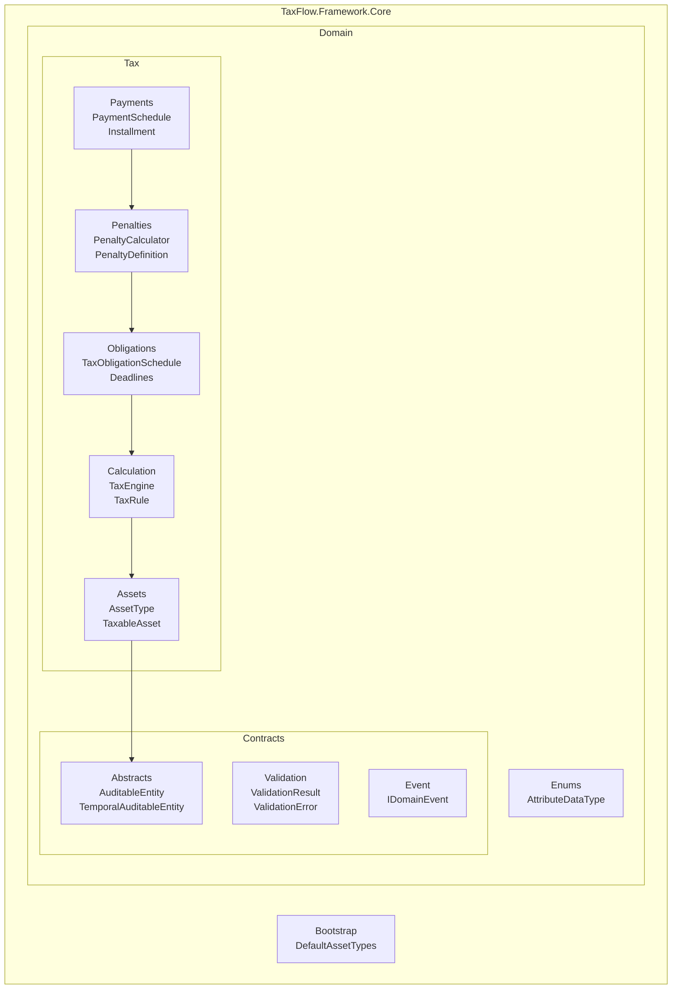
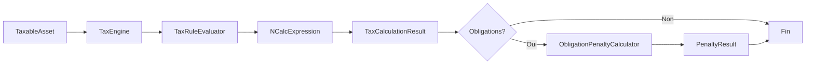

# TaxFlow Framework

[](https://dotnet.microsoft.com/)
[](LICENSE)

Framework de gestion fiscale flexible et extensible pour le calcul des taxes, la gestion des échéances et le calcul des pénalités.

## ?? Fonctionnalités

- **?? Calcul de Taxes Dynamique** : Expressions NCalc pour des règles fiscales flexibles
- **?? Gestion des Échéances** : Deadlines de déclaration et de paiement avec périodes de grâce
- **?? Calcul des Pénalités** : Pénalités d'assiette et de recouvrement avec taux progressifs
- **? Validation Riche** : Résultats de validation structurés avec codes d'erreur
- **?? Extensible** : Architecture modulaire basée sur Domain-Driven Design

## ?? Structure du Projet



## ?? Démarrage Rapide

### 1. Définir un Type d'Actif

```csharp
using Core.Domain.Tax.Assets;
using Core.Domain.Tax.Calculation;
using Core.Domain.Contracts;
using Core.Domain.Enums;

// Créer le type d'actif
var realEstate = AssetType.Create("Immobilier", "Biens immobiliers");

// Ajouter les attributs attendus
realEstate
    .AddExpectedAttribute(AttributeDefinition.Create(
        "ValeurVenale", "Valeur Vénale", AttributeDataType.Number, isRequired: true))
    .AddExpectedAttribute(AttributeDefinition.Create(new EnumDefinition
    {
        Key = "TypePropriete",
        Label = "Type de Propriété",
        Items = {
            new EnumItem { Code = "PB", Label = "Propriété Bâtie" },
            new EnumItem { Code = "PNB", Label = "Propriété Non Bâtie" }
        }
    }));

// Ajouter une règle fiscale
realEstate.AddTaxRule(new TaxRule
{
    Key = "TFB",
    Label = "Taxe Foncière Bâtie",
    Expression = "[TypePropriete] == 'Propriété Bâtie' ? [ValeurVenale] * 0.0075 : 0"
});
```

### 2. Calculer les Taxes

```csharp
// Créer un actif imposable
var attributes = new Collection<ExtendedAttribute>
{
    ExtendedAttribute.Create("ValeurVenale", "50000000", AttributeDataType.Number, true),
    ExtendedAttribute.Create("TypePropriete", "PB", AttributeDataType.Enum, true)
};

var asset = TaxableAsset.Create(realEstate, attributes);

// Calculer avec options
var result = asset.CalculateTaxes(new TaxEngineOptions
{
    Currency = "XOF",
    Precision = 0,
    ForDate = DateTimeOffset.Now
});

Console.WriteLine($"Total: {result.Total:N0} {result.Currency}");
// Output: Total: 375,000 XOF

foreach (var line in result.Lines)
{
    Console.WriteLine($"  {line.Label}: {line.RoundedAmount:N0}");
}
```

### 3. Configurer les Obligations avec Périodes de Grâce

```csharp
using Core.Domain.Tax.Obligations;
using Core.Domain.Tax.Penalties;

var schedule = TaxObligationSchedule.Create()
    // Échéance de déclaration avec 2 semaines de grâce
    .WithDeclarationDeadline(
        DeclarationDeadline.Create(
            "DECL_2025",
            "Déclaration 2025",
            new DateTimeOffset(2025, 3, 31, 0, 0, 0, TimeSpan.Zero),
            Duration.Weeks(2))  // Période de grâce flexible
        .WithPenalty(new PenaltyDefinition
        {
            Type = PenaltyType.Assiette,
            FixedAmount = 100_000m,
            AnnualRate = 0.10m,
            Period = Duration.Months(1)  // Périodicité mensuelle
        }))
    
    // Échéance de paiement (50% du montant)
    .AddPaymentDeadline(
        PaymentDeadline.Create(
            "PAY_1",
            "Paiement Semestriel 1",
            new DateTimeOffset(2025, 4, 30, 0, 0, 0, TimeSpan.Zero),
            fraction: 0.5m,
            order: 1,
            Duration.Days(10))
        .WithPenalty(new PenaltyDefinition
        {
            Type = PenaltyType.Recouvrement,
            AnnualRate = 0.12m,
            Period = Duration.Days(30)
        }))
    
    // Deuxième échéance (50% restant)
    .AddPaymentDeadline(
        PaymentDeadline.Create(
            "PAY_2",
            "Paiement Semestriel 2",
            new DateTimeOffset(2025, 10, 31, 0, 0, 0, TimeSpan.Zero),
            fraction: 0.5m,
            order: 2,
            Duration.Days(10))
        .WithPenalty(new PenaltyDefinition
        {
            Type = PenaltyType.Recouvrement,
            AnnualRate = 0.12m,
            Period = Duration.Days(30)
        }));

// Valider et associer à la règle
var validation = schedule.Validate();
if (validation.IsValid)
{
    rule.ConfigureObligationSchedule(schedule);
}
```

### 4. Calculer les Pénalités

```csharp
var calculator = new ObligationPenaltyCalculator(new PenaltyPolicy 
{ 
    DaysInYear = 365 
});

// Paiements effectués
var payments = new Dictionary<string, decimal>
{
    { "PAY_1", 100_000m }  // Paiement partiel
};

var penalties = calculator.Calculate(
    rule,
    taxAmount: 375_000m,
    asOf: new DateTimeOffset(2025, 6, 15, 0, 0, 0, TimeSpan.Zero),
    payments);

Console.WriteLine($"Pénalités de déclaration: {penalties.TotalDeclarationPenalty:N0}");
Console.WriteLine($"Pénalités de paiement: {penalties.TotalPaymentPenalty:N0}");
Console.WriteLine($"Total pénalités: {penalties.TotalAmount:N0}");
```

## ?? Flux de Calcul



## ?? Documentation Complète

Consultez la [Documentation du Domaine](docs/DOMAIN.md) pour :
- Guide détaillé de chaque module
- Exemples complets avec cas d'usage
- Diagrammes d'architecture Mermaid
- [API Reference](docs/API.md)

## ?? Tests

```bash
cd TaxFlow
dotnet test
```

Résultat attendu : 45 tests passent avec succès.

## ?? Concepts Clés

| Concept | Description |
|---------|-------------|
| `AssetType` | Type d'actif avec attributs attendus et règles fiscales |
| `TaxableAsset` | Instance d'un actif avec valeurs d'attributs |
| `TaxRule` | Règle fiscale avec expression NCalc dynamique |
| `TaxObligationSchedule` | Calendrier des obligations (déclaration/paiement) |
| `Duration` | Période flexible (jours, semaines, mois, années) |
| `PenaltyDefinition` | Définition d'une pénalité (taux, périodicité, plafond) |

## ??? Prérequis

- .NET 10.0 SDK
- NCalc (pour l'évaluation des expressions)

## ?? Sécurité

- Ne jamais évaluer des expressions NCalc provenant de sources non fiables
- Valider les entrées utilisateur avant utilisation
- Journaliser les erreurs d'évaluation

## ?? Contribution

1. Fork le projet
2. Créer une branche (`git checkout -b feature/AmazingFeature`)
3. Commit les changements (`git commit -m 'Add AmazingFeature'`)
4. Push (`git push origin feature/AmazingFeature`)
5. Ouvrir une Pull Request

## ?? Licence

Distribué sous licence MIT. Voir `LICENSE` pour plus d'informations.