# TaxFlow - Documentation du Domaine

## Table des Matières

1. [Vue d'Ensemble](#vue-densemble)
2. [Architecture du Domaine](#architecture-du-domaine)
3. [Module Localization](#module-localization)
4. [Module Assets](#module-assets)
5. [Module Calculation](#module-calculation)
6. [Module Obligations](#module-obligations)
7. [Module Penalties](#module-penalties)
8. [Module Payments](#module-payments)
9. [Validation](#validation)
10. [Exemples Complets](#exemples-complets)
11. [Diagrammes](#diagrammes)

---

## Vue d'Ensemble

TaxFlow est un framework de gestion fiscale qui permet de :

- **Définir des types d'actifs** avec leurs attributs attendus
- **Créer des règles fiscales** avec des expressions dynamiques (NCalc)
- **Calculer les taxes** basées sur les attributs des actifs
- **Gérer les échéances** de déclaration et de paiement
- **Calculer les pénalités** en cas de retard (assiette et recouvrement)
- **Suivre les paiements** et leur allocation aux échéances
- **Localiser tous les messages** (erreurs, avertissements, libellés) pour éviter les *magic strings*

### Principes de Conception

- **Domain-Driven Design (DDD)** : Séparation claire des agrégats et entités
- **SOLID** : Classes à responsabilité unique, injection de dépendances
- **Immutabilité** : Utilisation de records et propriétés `init`
- **Validation riche** : Types structurés pour les erreurs de validation
- **Localisation centralisée** : Tous les messages passent par `LocalizedString`/`LocalizedTemplate`

---

## Architecture du Domaine

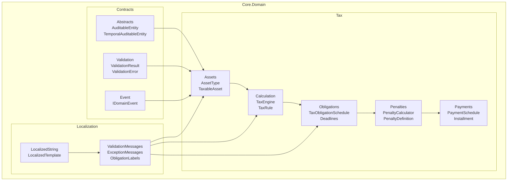

---

## Module Localization

### Objectifs

- Éliminer les *magic strings* dans le domaine fiscal.
- Centraliser toutes les traductions pour assurer la cohérence UI/API.
- Supporter plusieurs cultures (fr-FR par défaut, en-US, ar-SA, pt-PT, es-ES).

### Composants

| Classe/Objet | Description |
|--------------|-------------|
| `LocalizedString` | Valeur localisée (fluent API `.En()`, `.Ar()`, `.Pt()`, `.Es()`). |
| `LocalizedTemplate` | Message paramétré avec placeholders nommés (`{attributeKey}`). |
| `LocalizationContext` | Gestion du contexte de culture courant (scope `WithCulture`). |
| `ValidationMessages` | Messages standardisés pour `ValidationResult`. |
| `ExceptionMessages` | Messages d'exception prêts à l'emploi (attributs, règles, obligations, dates). |
| `ObligationLabels` | Libellés localisés pour les enums (périodicité, régimes, pénalités, textes légaux). |

### Exemple

```csharp
// Chaîne localisée avec traductions additionnelles
var paymentLabel = LocalizedString.Create("Paiement")
    .En("Payment")
    .Ar("دفع")
    .Pt("Pagamento");

// Message d'exception paramétré
throw new ArgumentException(
    ExceptionMessages.AttributeValidationFailed.Format(
        ("errorMessage", validationResult.ErrorMessage)));

// Utilisation d'un scope de culture
using (LocalizationContext.WithCulture("en-US"))
{
    Console.WriteLine(paymentLabel.GetValue()); // "Payment"
}
```

### Intégration dans le Domaine

- **Attributs / Règles** : `AttributeDefinition`, `AssetType`, `TaxRuleEvaluator` utilisent `ExceptionMessages`.
- **Obligations** : `TaxObligationSchedule`, `PaymentDeadline`, `LegalReference` s'appuient sur `ValidationMessages`/`ObligationLabels`.
- **Moteur de calcul** : `TaxEngine` garantit des erreurs et warnings localisés.
- **Tests** : vérifications adaptées pour accepter les nouvelles formulations localisées.

---

## Module Assets

### Concepts Clés

| Classe | Description |
|--------|-------------|
| `AssetType` | Définit un type d'actif avec ses attributs attendus et règles fiscales |
| `TaxableAsset` | Instance d'un actif soumis à taxation |
| `AttributeDefinition` | Définition d'un attribut attendu (clé, type, obligatoire) |
| `ExtendedAttribute` | Valeur d'un attribut pour un actif spécifique |
| `AttributeValidator` | Valide les attributs contre les définitions |

### Diagramme de Classes - Assets

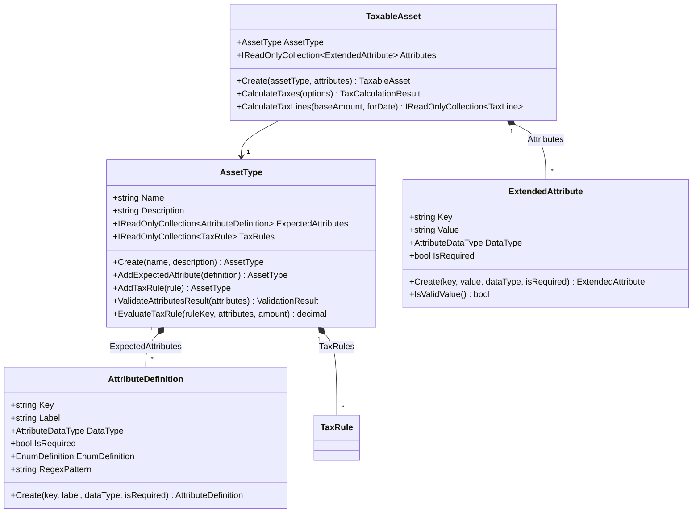

### AssetType (Agrégat Racine)

`AssetType` est l'agrégat principal qui définit :
- Les **attributs attendus** pour ce type d'actif
- Les **règles fiscales** applicables

```csharp
// Création d'un type d'actif "Immobilier"
var realEstate = AssetType.Create("Immobilier", "Biens immobiliers");

// Ajout des attributs attendus
realEstate
    .AddExpectedAttribute(AttributeDefinition.Create(
        "ValeurVenale", 
        "Valeur Vénale", 
        AttributeDataType.Number, 
        isRequired: true))
    .AddExpectedAttribute(AttributeDefinition.Create(
        new EnumDefinition
        {
            Key = "TypePropriete",
            Label = "Type de Propriété",
            Items = {
                new EnumItem { Code = "PB", Label = "Propriété Bâtie" },
                new EnumItem { Code = "PNB", Label = "Propriété Non Bâtie" }
            }
        }))

    // Ajout d'une règle fiscale
    .AddTaxRule(new TaxRule
    {
        Key = "TFB",
        Label = "Taxe Foncière sur Propriété Bâtie",
        Expression = "[TypePropriete] == 'Propriété Bâtie' ? [ValeurVenale] * 0.0075 : 0"
    });
```

### TaxableAsset

Représente un actif concret avec ses valeurs d'attributs :

```csharp
// Création d'un actif imposable
var attributes = new Collection<ExtendedAttribute>
{
    ExtendedAttribute.Create("ValeurVenale", "1000000", AttributeDataType.Number, true),
    ExtendedAttribute.Create("TypePropriete", "Propriété Bâtie", AttributeDataType.Enum, true)
};

var asset = TaxableAsset.Create(realEstate, attributes);

// Calcul des taxes
var result = asset.CalculateTaxes();
Console.WriteLine($"Total: {result.Total}"); // 7500 (1000000 * 0.0075)
```

### Validation des Attributs

```csharp
// Validation avec résultat structuré
var validationResult = realEstate.ValidateAttributesResult(attributes);

if (validationResult.HasErrors)
{
    foreach (var error in validationResult.Errors)
    {
        Console.WriteLine($"[{error.Code}] {error.PropertyName}: {error.Message}");
    }
}
```

---

## Module Calculation

### Concepts Clés

| Classe | Description |
|--------|-------------|
| `TaxRule` | Règle fiscale avec expression NCalc |
| `TaxEngine` | Moteur de calcul haute performance |
| `TaxLine` | Ligne de résultat pour une règle |
| `TaxCalculationResult` | Résultat complet avec totaux et diagnostics |
| `TaxRuleEvaluator` | Évalue une règle individuelle |
| `IExpressionEvaluator` | Abstraction pour l'évaluation d'expressions |

### Diagramme de Séquence - Calcul des Taxes

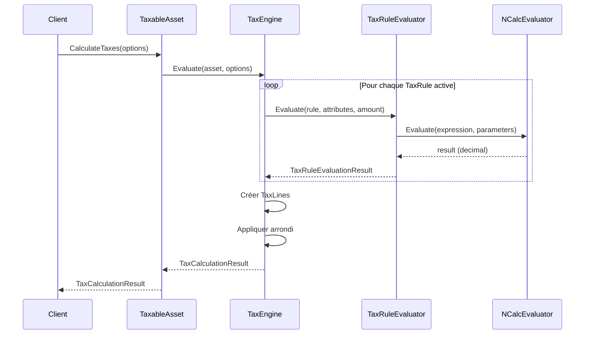

### TaxRule

Définit une règle fiscale avec une expression dynamique :

```csharp
var rule = new TaxRule
{
    Key = "TFNB",
    Label = "Taxe Foncière sur Propriété Non Bâtie",
    Expression = """
        [TypePropriete] == 'Propriété Non Bâtie' 
            ? [ValeurVenale] * 0.005 
            : 0
    """,
    Enabled = true,
    ValidFrom = new DateTimeOffset(2024, 1, 1, 0, 0, 0, TimeSpan.Zero)
};
```

### Variables Disponibles dans les Expressions

| Variable | Description |
|----------|-------------|
| `[AttributKey]` | Valeur de l'attribut (nombre, booléen ou chaîne) |
| `[EnumKey]` | Label de l'énumération |
| `[EnumKeyCode]` | Code de l'énumération |
| `[EnumKeyLabel]` | Label de l'énumération |
| `amount` | Montant de base optionnel |

### TaxEngine

Moteur optimisé pour le calcul de taxes :

```csharp
// Options de calcul
var options = new TaxEngineOptions
{
    ForDate = DateTimeOffset.Now,
    BaseAmount = 100000m,
    Currency = "XOF",
    Precision = 2,
    Rounding = MidpointRounding.AwayFromZero,
    StrictValidation = true,
    IncludeRuleResults = true
};

// Calcul
var result = TaxEngine.Evaluate(asset, options);

// Résultats
Console.WriteLine($"Total: {result.Total} {result.Currency}");
foreach (var line in result.Lines)
{
    Console.WriteLine($"  {line.Label}: {line.RoundedAmount}");
}

// Diagnostic
foreach (var warning in result.Warnings)
{
    Console.WriteLine($"⚠️ {warning}");
}
```

### Calcul au Prorata

```csharp
// Calcul pour une période avec prorata
var result = TaxEngine.EvaluateForPeriod(
    asset,
    from: new DateTimeOffset(2025, 7, 1, 0, 0, 0, TimeSpan.Zero),
    to: new DateTimeOffset(2025, 12, 31, 0, 0, 0, TimeSpan.Zero),
    daysInYear: 365,
    options);

// Les montants sont proratés sur 184 jours / 365
```

---

## Module Obligations

### Concepts Clés

| Classe | Description |
|--------|-------------|
| `TaxObligationSchedule` | Calendrier des obligations fiscales (multiples déclarations et paiements) |
| `DeclarationDeadline` | Échéance de déclaration avec périodicité et régime |
| `PaymentDeadline` | Échéance de paiement avec type (acompte, solde) et fraction |
| `Duration` | Durée flexible (jours, semaines, mois, années) |
| `LegalReference` | Référence légale justifiant une obligation |
| `DeadlinePeriodicity` | Périodicité (mensuelle, trimestrielle, annuelle, événementielle) |
| `TaxRegime` | Régime fiscal (général, simplifié, réel, micro) |
| `PaymentType` | Type de paiement (acompte, versement, solde) |
| `ObligationPenaltyCalculator` | Calcule les pénalités basées sur les obligations |

### Diagramme de Classes - Obligations

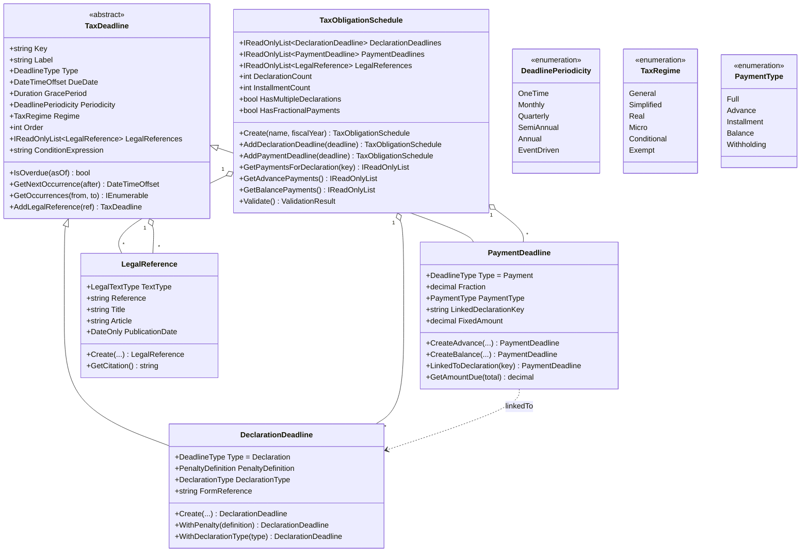

### Pluralité des Échéances

Le système supporte désormais plusieurs échéances de déclaration et de paiement par taxe :

```csharp
// Exemple : TVA avec déclarations mensuelles et paiements fractionnés
var schedule = TaxObligationSchedule.Create("TVA 2025", fiscalYear: 2025)
    // Référence légale au niveau du calendrier
    .AddLegalReference(LegalReference.Create(
        LegalTextType.TaxCode,
        "CGI Art. 287",
        "Déclarations et paiements de TVA",
        "287"))
    
    // Déclaration mensuelle de janvier
    .AddDeclarationDeadline(
        DeclarationDeadline.Create(
            "TVA_M01",
            "Déclaration TVA Janvier",
            new DateTimeOffset(2025, 2, 20, 0, 0, 0, TimeSpan.Zero),
            DeadlinePeriodicity.Monthly,
            TaxRegime.General,
            Duration.Zero,
            order: 1)
        .WithFormReference("CA3")
        .AddLegalReference(LegalReference.Create(
            LegalTextType.TaxCode, "CGI Art. 287-1", "Déclaration mensuelle")))
    
    // Déclaration mensuelle de février
    .AddDeclarationDeadline(
        DeclarationDeadline.Create(
            "TVA_M02",
            "Déclaration TVA Février",
            new DateTimeOffset(2025, 3, 20, 0, 0, 0, TimeSpan.Zero),
            DeadlinePeriodicity.Monthly,
            TaxRegime.General,
            Duration.Zero,
            order: 2))
    
    // Acompte (1er versement - 25%)
    .AddPaymentDeadline(
        PaymentDeadline.CreateAdvance(
            "TVA_ADV_Q1",
            "Acompte TVA T1",
            new DateTimeOffset(2025, 4, 15, 0, 0, 0, TimeSpan.Zero),
            fraction: 0.25m,
            order: 1)
        .LinkedToDeclaration("TVA_M01")
        .WithPenalty(new PenaltyDefinition
        {
            Type = PenaltyType.Recouvrement,
            AnnualRate = 0.048m,
            Period = Duration.Months(1)
        }))
    
    // Solde (75% restant)
    .AddPaymentDeadline(
        PaymentDeadline.CreateBalance(
            "TVA_BAL",
            "Solde TVA",
            new DateTimeOffset(2025, 5, 15, 0, 0, 0, TimeSpan.Zero),
            fraction: 0.75m,
            order: 2)
        .LinkedToDeclaration("TVA_M01"));
```

### Caractéristiques des Échéances

Chaque échéance est caractérisée par :

| Propriété | Description |
|-----------|-------------|
| **Nature** | Déclaration ou paiement (`DeadlineType`) |
| **Périodicité** | Mensuelle, trimestrielle, annuelle, événementielle (`DeadlinePeriodicity`) |
| **Date** | Date d'échéance fixe ou calculée (`DueDate`) |
| **Régime** | Général, simplifié, conditionnel (`TaxRegime`) |
| **Base légale** | Références légales explicites (`LegalReference`) |

### Paiements Fractionnés

```csharp
// Système d'acomptes et solde pour l'IS
var schedule = TaxObligationSchedule.Create("IS 2025")
    // 4 acomptes trimestriels de 25%
    .AddPaymentDeadline(PaymentDeadline.CreateAdvance(
        "IS_ADV_Q1", "Acompte T1", dueQ1, 0.25m, 1))
    .AddPaymentDeadline(PaymentDeadline.CreateAdvance(
        "IS_ADV_Q2", "Acompte T2", dueQ2, 0.25m, 2))
    .AddPaymentDeadline(PaymentDeadline.CreateAdvance(
        "IS_ADV_Q3", "Acompte T3", dueQ3, 0.25m, 3))
    .AddPaymentDeadline(PaymentDeadline.CreateAdvance(
        "IS_ADV_Q4", "Acompte T4", dueQ4, 0.25m, 4))
    
    // Solde de régularisation (0% si acomptes = 100%)
    .AddPaymentDeadline(PaymentDeadline.CreateBalance(
        "IS_BAL", "Solde IS", dueBalance, 0m, 5));

// Vérifier la structure
var advances = schedule.GetAdvancePayments();
var balance = schedule.GetBalancePayments();
Console.WriteLine($"Acomptes: {advances.Count}, Soldes: {balance.Count}");
```

### Références Légales

```csharp
// Référence légale complète
var legalRef = LegalReference.Create(
    LegalTextType.FinanceLaw,
    "LF 2025 n°2024-1234",
    "Loi de finances pour 2025",
    article: "42")
    .WithDates(
        publicationDate: new DateOnly(2024, 12, 30),
        effectiveDate: new DateOnly(2025, 1, 1))
    .WithUrl("https://legifrance.gouv.fr/...);

// Obtenir la citation
Console.WriteLine(legalRef.GetCitation());
// Output: "LF LF 2025 n°2024-1234, art. 42"

// Ajouter à une échéance
deadline.AddLegalReference(legalRef);
```

### Échéances Récurrentes

```csharp
// Déclaration mensuelle avec calcul des occurrences
var monthlyDecl = DeclarationDeadline.Create(
    "TVA_MENSUELLE",
    "Déclaration TVA Mensuelle",
    new DateTimeOffset(2025, 1, 20, 0, 0, 0, TimeSpan.Zero),
    DeadlinePeriodicity.Monthly);

// Prochaine occurrence après une date
var next = monthlyDecl.GetNextOccurrence(DateTimeOffset.Now);

// Toutes les occurrences dans une période
var occurrences = monthlyDecl.GetOccurrences(
    new DateTimeOffset(2025, 1, 1, 0, 0, 0, TimeSpan.Zero),
    new DateTimeOffset(2025, 12, 31, 0, 0, 0, TimeSpan.Zero));

foreach (var date in occurrences)
{
    Console.WriteLine($"Échéance: {date:yyyy-MM-dd}");
}
```

---

## Module Penalties

### Concepts Clés

| Classe | Description |
|--------|-------------|
| `PenaltyPolicy` | Politique de calcul des pénalités |
| `PenaltyDefinition` | Définition d'une pénalité (taux, périodicité, etc.) |
| `PenaltyCalculator` | Calculateur principal (utilise PaymentSchedule) |
| `AssiettePenaltyRule` | Règle de pénalité d'assiette |
| `RecouvrementPenaltyRule` | Règle de pénalité de recouvrement |
| `PenaltyAccrual` | Ligne de pénalité calculée |

### Types de Pénalités

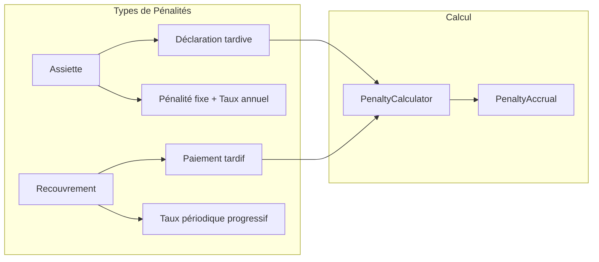

| Type | Description | Déclencheur |
|------|-------------|-------------|
| `Assiette` | Pénalité de déclaration tardive | Dépassement de l'échéance de déclaration |
| `Recouvrement` | Pénalité de paiement tardif | Dépassement d'une échéance de paiement |

### Diagramme de Séquence - Calcul des Pénalités

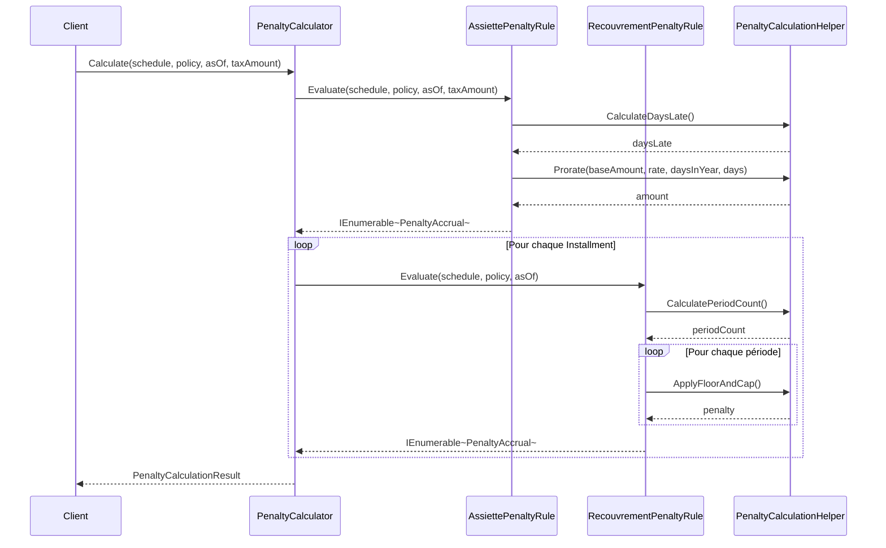

### PenaltyDefinition

```csharp
var penaltyDef = new PenaltyDefinition
{
    Type = PenaltyType.Recouvrement,
    
    // Période de grâce avant application des pénalités
    GracePeriod = Duration.Days(10),
    
    // Montant fixe (appliqué une fois)
    FixedAmount = 50_000m,
    
    // Taux annuel (proraté par période)
    AnnualRate = 0.12m,  // 12% par an
    
    // OU Taux périodique (prioritaire sur AnnualRate)
    PeriodRate = 0.10m,  // 10% par période
    PeriodRateIncrement = 0.01m,  // +1% par période supplémentaire
    
    // Périodicité
    Period = Duration.Months(1),
    
    // Limites
    Minimum = 10_000m,
    Cap = 500_000m,
    
    // Capitalisation (intérêts composés)
    Capitalize = false
};
```

### PenaltyPolicy

```csharp
var policy = new PenaltyPolicy
{
    DaysInYear = 365,           // Base de calcul annuel
    MinimumLineAmount = 100m    // Montant minimum par ligne
};

// Ajout des définitions
policy.AddOrUpdateDefinition(new PenaltyDefinition
{
    Type = PenaltyType.Assiette,
    FixedAmount = 100_000m,
    AnnualRate = 0.10m,
    Period = Duration.Days(30)
});

policy.AddOrUpdateDefinition(new PenaltyDefinition
{
    Type = PenaltyType.Recouvrement,
    AnnualRate = 0.12m,
    Period = Duration.Days(30)
});

// Validation
policy.Validate();
```

### Calcul avec PenaltyCalculator

```csharp
// Créer un échéancier de paiement
var installments = new[]
{
    new Installment(Guid.NewGuid(), 500_000m, 
        new DateTimeOffset(2025, 4, 30, 0, 0, 0, TimeSpan.Zero)),
    new Installment(Guid.NewGuid(), 500_000m, 
        new DateTimeOffset(2025, 7, 31, 0, 0, 0, TimeSpan.Zero))
};

var schedule = new PaymentSchedule(declarationId, liquidationId, installments);

// Appliquer un paiement partiel
schedule.ApplyPayment(new Payment(
    Guid.NewGuid(), 
    300_000m, 
    new DateTimeOffset(2025, 5, 15, 0, 0, 0, TimeSpan.Zero)));

// Calculer les pénalités
var result = PenaltyCalculator.Calculate(
    schedule,
    policy,
    asOf: new DateTimeOffset(2025, 8, 15, 0, 0, 0, TimeSpan.Zero),
    taxBaseAmount: 1_000_000m);

// Résultats
foreach (var accrual in result.Accruals)
{
    Console.WriteLine($"{accrual.LineType}: {accrual.Amount}");
    Console.WriteLine($"  Base: {accrual.BaseAmount}");
    Console.WriteLine($"  Taux: {accrual.Rate:P2}");
    Console.WriteLine($"  Jours de retard: {accrual.DaysLate}");
    Console.WriteLine($"  Période: {accrual.PeriodIndex}");
}
```

---

## Module Payments

### Concepts Clés

| Classe | Description |
|--------|-------------|
| `PaymentSchedule` | Échéancier de paiement |
| `Installment` | Échéance de paiement individuelle |
| `Payment` | Paiement reçu |
| `PaymentAllocation` | Allocation d'un paiement à une échéance |
| `AllocationStrategy` | Stratégie d'allocation (FIFO, etc.) |

### Diagramme de Classes - Payments

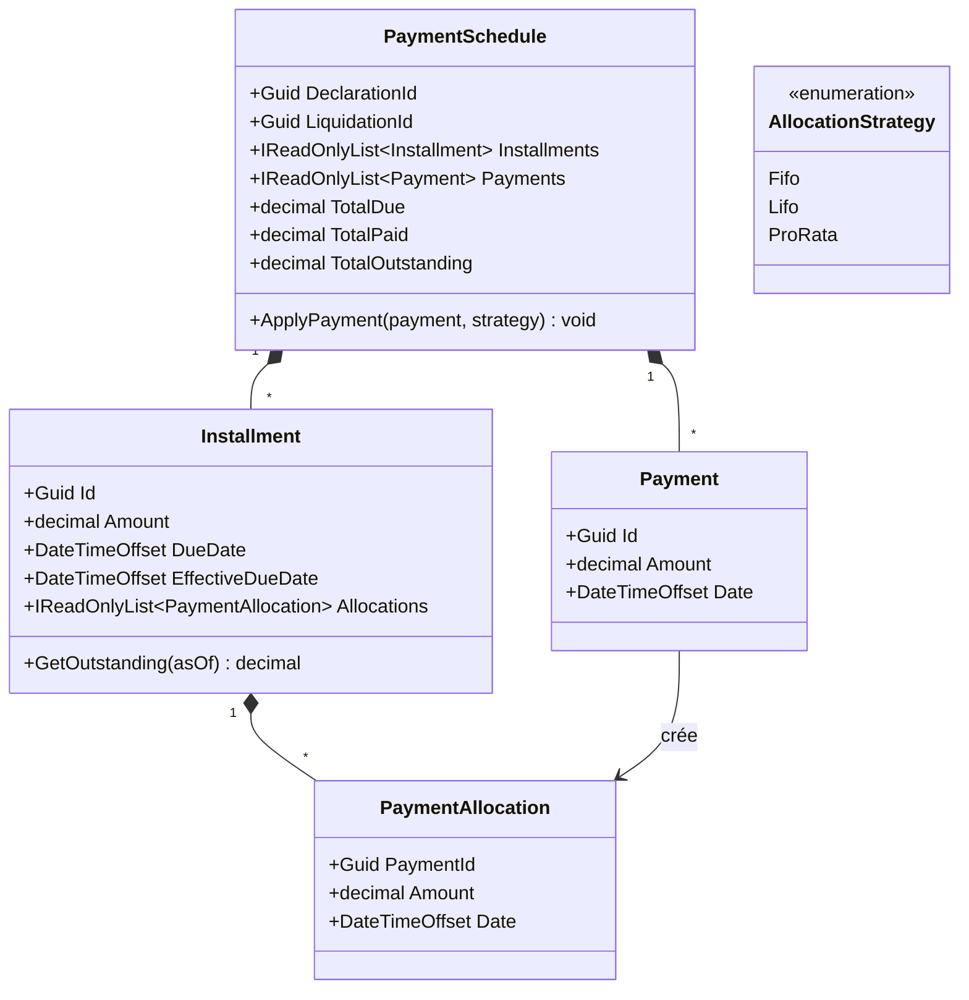

### PaymentSchedule

```csharp
// Création d'un échéancier
var schedule = new PaymentSchedule(
    declarationId: Guid.NewGuid(),
    liquidationId: Guid.NewGuid(),
    installments: new[]
    {
        new Installment(Guid.NewGuid(), 500_000m, 
            new DateTimeOffset(2025, 4, 30, 0, 0, 0, TimeSpan.Zero)),
        new Installment(Guid.NewGuid(), 500_000m, 
            new DateTimeOffset(2025, 7, 31, 0, 0, 0, TimeSpan.Zero))
    });

// Appliquer des paiements
schedule.ApplyPayment(new Payment(
    Guid.NewGuid(),
    600_000m,
    new DateTimeOffset(2025, 5, 1, 0, 0, 0, TimeSpan.Zero)));

// Vérifier les soldes
foreach (var inst in schedule.Installments)
{
    var outstanding = inst.GetOutstanding(DateTimeOffset.Now);
    Console.WriteLine($"Échéance {inst.DueDate:d}: Dû={inst.Amount}, Restant={outstanding}");
}
```

### Installment

```csharp
var installment = new Installment(
    id: Guid.NewGuid(),
    amount: 500_000m,
    dueDate: new DateTimeOffset(2025, 4, 30, 0, 0, 0, TimeSpan.Zero));

// Propriétés
Console.WriteLine($"Date d'échéance: {installment.DueDate}");
Console.WriteLine($"Date effective: {installment.EffectiveDueDate}");
Console.WriteLine($"Montant: {installment.Amount}");

// Solde à une date donnée
var outstanding = installment.GetOutstanding(DateTimeOffset.Now);
```

---

## Validation

### ValidationResult

Type structuré pour les résultats de validation :

```csharp
// Validation réussie
var success = ValidationResult.Success();

// Validation échouée
var failure = ValidationResult.Failure(new ValidationError(
    code: "MISSING_REQUIRED_ATTRIBUTE",
    message: "Attribut requis manquant: 'ValeurVenale'.",
    propertyName: "ValeurVenale"));

// Combinaison de résultats
var combined = ValidationResult.Combine(result1, result2, result3);

// Utilisation
if (combined.HasErrors)
{
    foreach (var error in combined.Errors)
    {
        Console.WriteLine($"[{error.Code}] {error.PropertyName}: {error.Message}");
    }
}
```

### Codes d'Erreur Standards

```csharp
public static class ValidationErrorCodes
{
    // Validation des attributs
    public const string DuplicateAttribute = "DUPLICATE_ATTRIBUTE";
    public const string MissingRequiredAttribute = "MISSING_REQUIRED_ATTRIBUTE";
    public const string InvalidDataType = "INVALID_DATA_TYPE";
    public const string InvalidValue = "INVALID_VALUE";
    public const string InvalidEnumValue = "INVALID_ENUM_VALUE";
    public const string MissingEnumDefinition = "MISSING_ENUM_DEFINITION";
    public const string InvalidRegexPattern = "INVALID_REGEX_PATTERN";
    public const string RegexMismatch = "REGEX_MISMATCH";

    // Validation des règles fiscales
    public const string RuleNotFound = "RULE_NOT_FOUND";
    public const string RuleDisabled = "RULE_DISABLED";
    public const string RuleEvaluationFailed = "RULE_EVALUATION_FAILED";
    public const string MissingParameters = "MISSING_PARAMETERS";
    public const string EmptyRuleKey = "EMPTY_RULE_KEY";
}
```

---

## Exemples Complets

### Exemple 1 : Calcul de Taxe Foncière

```csharp
// 1. Définir le type d'actif
var realEstate = AssetType.Create("Immobilier", "Biens immobiliers");

realEstate
    .AddExpectedAttribute(AttributeDefinition.Create(
        "ValeurVenale", "Valeur Vénale", AttributeDataType.Number, true))
    .AddExpectedAttribute(AttributeDefinition.Create(new EnumDefinition
    {
        Key = "TypePropriete",
        Label = "Type de Propriété",
        Items = {
            new EnumItem { Code = "PB", Label = "Propriété Bâtie", Order = 1 },
            new EnumItem { Code = "PNB", Label = "Propriété Non Bâtie", Order = 2 }
        }
    }));

// 2. Définir les règles fiscales
realEstate.AddTaxRule(new TaxRule
{
    Key = "TFB",
    Label = "Taxe Foncière Bâtie",
    Expression = "[TypePropriete] == 'Propriété Bâtie' ? [ValeurVenale] * 0.0075 : 0"
});

realEstate.AddTaxRule(new TaxRule
{
    Key = "TFNB",
    Label = "Taxe Foncière Non Bâtie",
    Expression = "[TypePropriete] == 'Propriété Non Bâtie' ? [ValeurVenale] * 0.005 : 0"
});

// 3. Créer un actif imposable
var attributes = new Collection<ExtendedAttribute>
{
    ExtendedAttribute.Create("ValeurVenale", "50000000", AttributeDataType.Number, true),
    ExtendedAttribute.Create("TypePropriete", "PB", AttributeDataType.Enum, true)
};

var asset = TaxableAsset.Create(realEstate, attributes);

// 4. Calculer les taxes
var result = asset.CalculateTaxes(new TaxEngineOptions
{
    Currency = "XOF",
    Precision = 0
});

Console.WriteLine($"Total: {result.Total:N0} {result.Currency}");
// Output: Total: 375,000 XOF

foreach (var line in result.Lines)
{
    Console.WriteLine($"  {line.Label}: {line.RoundedAmount:N0}");
}
// Output:
//   Taxe Foncière Bâtie: 375,000
//   Taxe Foncière Non Bâtie: 0
```

### Exemple 2 : Gestion des Pénalités de Retard

```csharp
// 1. Configurer la politique de pénalités
var policy = new PenaltyPolicy { DaysInYear = 365 };

policy.AddOrUpdateDefinition(new PenaltyDefinition
{
    Type = PenaltyType.Assiette,
    FixedAmount = 100_000m,
    AnnualRate = 0.10m,
    GracePeriod = Duration.Days(15),
    Period = Duration.Months(1)
});

policy.AddOrUpdateDefinition(new PenaltyDefinition
{
    Type = PenaltyType.Recouvrement,
    AnnualRate = 0.12m,
    GracePeriod = Duration.Days(5),
    Period = Duration.Days(30)
});

// 2. Créer l'échéancier
var schedule = new PaymentSchedule(
    Guid.NewGuid(),
    null,
    new[] {
        new Installment(Guid.NewGuid(), 375_000m, 
            new DateTimeOffset(2025, 4, 30, 0, 0, 0, TimeSpan.Zero))
    });

// 3. Calculer les pénalités au 15 juin (45 jours de retard)
var asOf = new DateTimeOffset(2025, 6, 15, 0, 0, 0, TimeSpan.Zero);
var penalties = PenaltyCalculator.Calculate(schedule, policy, asOf, 375_000m);

Console.WriteLine($"Pénalités totales: {penalties.Total:N0} XOF");
foreach (var accrual in penalties.Accruals)
{
    Console.WriteLine($"  {accrual.LineType}: {accrual.Amount:N0}");
}
```

### Exemple 3 : Calendrier d'Obligations Complet

```csharp
// 1. Créer le calendrier
var schedule = TaxObligationSchedule.Create()
    .WithDeclarationDeadline(
        DeclarationDeadline.Create(
            "DECL_TF_2025",
            "Déclaration Taxe Foncière 2025",
            new DateTimeOffset(2025, 3, 31, 0, 0, 0, TimeSpan.Zero),
            Duration.Weeks(2))
        .WithPenalty(new PenaltyDefinition
        {
            Type = PenaltyType.Assiette,
            FixedAmount = 100_000m,
            AnnualRate = 0.10m,
            Period = Duration.Months(1)
        }))
    .AddPaymentDeadline(
        PaymentDeadline.Create(
            "PAY_TF_2025_Q1",
            "Premier Versement",
            new DateTimeOffset(2025, 4, 30, 0, 0, 0, TimeSpan.Zero),
            fraction: 0.5m,
            order: 1,
            gracePeriod: Duration.Days(5))
        .WithPenalty(new PenaltyDefinition
        {
            Type = PenaltyType.Recouvrement,
            AnnualRate = 0.12m,
            Period = Duration.Days(30)
        }))
    .AddPaymentDeadline(
        PaymentDeadline.Create(
            "PAY_TF_2025_Q2",
            "Deuxième Versement",
            new DateTimeOffset(2025, 7, 31, 0, 0, 0, TimeSpan.Zero),
            fraction: 0.5m,
            order: 2,
            gracePeriod: Duration.Days(5))
        .WithPenalty(new PenaltyDefinition
        {
            Type = PenaltyType.Recouvrement,
            AnnualRate = 0.12m,
            Period = Duration.Days(30)
        }))
    .AddPaymentDeadline(
        PaymentDeadline.Create(
            "PAY_TF_2025_Q3",
            "Troisième Versement",
            new DateTimeOffset(2025, 10, 31, 0, 0, 0, TimeSpan.Zero),
            fraction: 0.5m,
            order: 3,
            gracePeriod: Duration.Days(5))
        .WithPenalty(new PenaltyDefinition
        {
            Type = PenaltyType.Recouvrement,
            AnnualRate = 0.12m,
            Period = Duration.Days(30)
        }))
    .AddPaymentDeadline(
        PaymentDeadline.Create(
            "PAY_TF_2025_Q4",
            "Quatrième Versement",
            new DateTimeOffset(2026, 1, 31, 0, 0, 0, TimeSpan.Zero),
            fraction: 0.5m,
            order: 4,
            gracePeriod: Duration.Days(5))
        .WithPenalty(new PenaltyDefinition
        {
            Type = PenaltyType.Recouvrement,
            AnnualRate = 0.12m,
            Period = Duration.Days(30)
        }));

// 2. Valider le calendrier
var validation = schedule.Validate();
if (validation.HasErrors)
{
    throw new InvalidOperationException(validation.ErrorMessage);
}

// 3. Associer à la règle fiscale
var taxRule = new TaxRule { Key = "TF_2025", Label = "Taxe Foncière 2025" };
taxRule.ConfigureObligationSchedule(schedule);

// 4. Vérifier les échéances en retard
var asOf = new DateTimeOffset(2025, 8, 15, 0, 0, 0, TimeSpan.Zero);
var overdue = schedule.GetOverdueDeadlines(asOf);

Console.WriteLine($"Échéances en retard au {asOf:d}:");
foreach (var deadline in overdue)
{
    Console.WriteLine($"  - {deadline.Label} (due: {deadline.DueDate:d}, retard: {deadline.GetDaysLate(asOf)} jours)");
}
```

---

## Diagrammes

### Vue d'Ensemble de l'Architecture

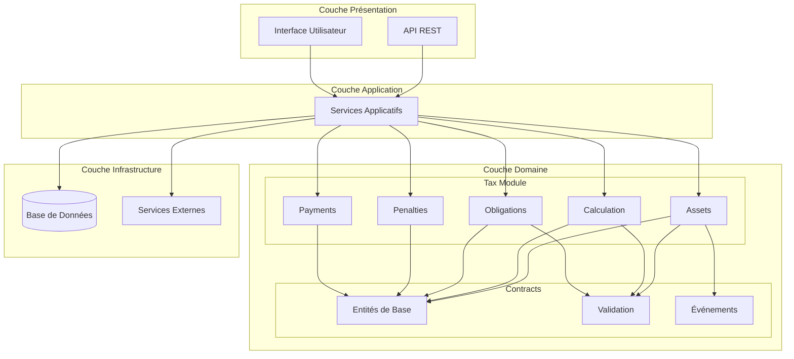

### Flux de Calcul des Taxes

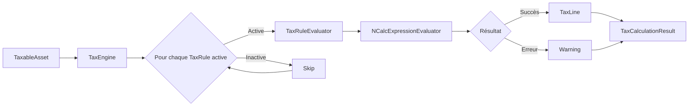

### Flux de Calcul des Pénalités

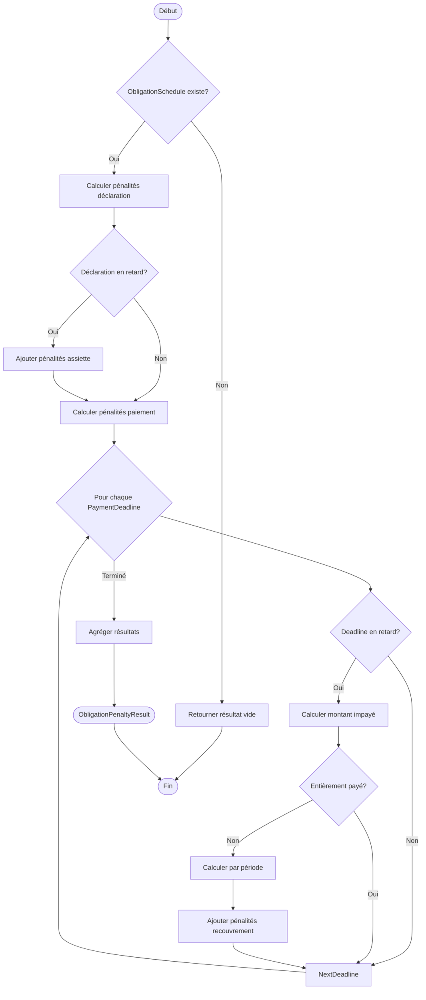

### Modèle des Obligations

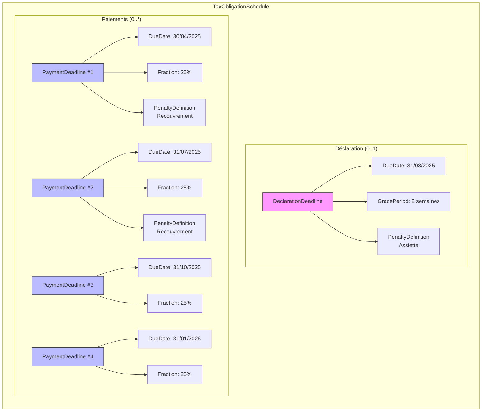

### État des Échéances dans le Temps

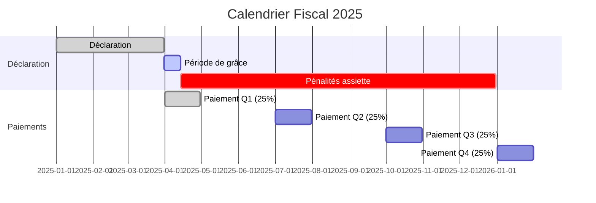

---

## Références

- **NCalc** : Bibliothèque d'évaluation d'expressions dynamiques
- **Domain-Driven Design** 
- **.NET 10** : Framework cible
- **Mermaid** : Diagrammes dans Markdown

---

*Documentation générée automatiquement - TaxFlow Framework v1.0*
